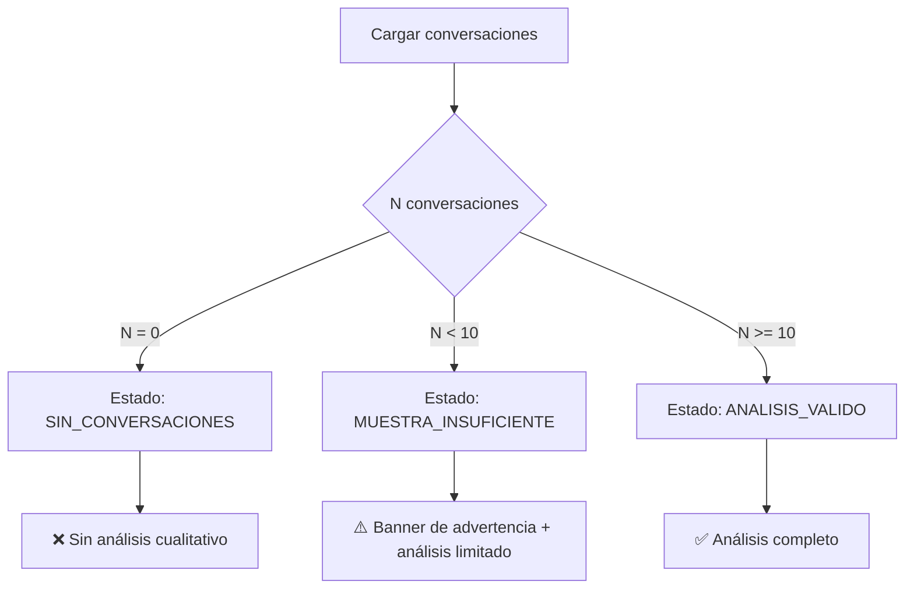

# Changelog v6.3.8 - Umbral Mínimo de Conversaciones

**Fecha:** 04 Febrero 2026  
**Versión:** 6.3.8  
**Tipo:** Feature - Validación de Calidad

---

## 🎯 Resumen Ejecutivo

Se implementó un **umbral mínimo de 10 conversaciones** para garantizar la validez de los análisis cualitativos. Cuando un elemento tiene menos de 10 conversaciones, el sistema automáticamente marca el análisis como "Muestra Insuficiente" y muestra advertencias visuales en el reporte.

---

## ✨ Nuevas Características

### 1. Constante de Umbral Mínimo

```python
UMBRAL_MINIMO_CONVERSACIONES = 10  # Mínimo de conversaciones requeridas para análisis cualitativo válido
```

**Ubicación:** `generar_reporte_cr_universal_v6.3.6.py` (línea 150)

### 2. Validación Automática en `analyze_conversations_with_llm()`

La función ahora valida tres estados:

| Estado | Condición | Resultado |
|--------|-----------|-----------|
| `SIN_CONVERSACIONES` | N = 0 | ❌ Sin conversaciones disponibles |
| `MUESTRA_INSUFICIENTE` | N < 10 | ⚠️ Muestra insuficiente (no concluyente) |
| `ANALISIS_VALIDO` | N ≥ 10 | ✅ Análisis válido y concluyente |

**Código agregado:**

```python
n_conversaciones = len(df_conversations)

# Validación 1: Sin conversaciones
if df_conversations.empty:
    return {
        "proceso": proceso,
        "total_conversaciones": 0,
        "estado": "SIN_CONVERSACIONES",
        # ...
    }

# Validación 2: Muestra insuficiente (< UMBRAL_MINIMO)
if n_conversaciones < UMBRAL_MINIMO_CONVERSACIONES:
    return {
        "proceso": proceso,
        "total_conversaciones": n_conversaciones,
        "estado": "MUESTRA_INSUFICIENTE",
        "hallazgo_principal": f"⚠️ Muestra insuficiente: solo {n_conversaciones} conversaciones..."
        # ...
    }
```

### 3. Indicadores Visuales en HTML

#### Badge de Conversaciones con Color Semántico

```html
<!-- Verde si ≥10, Rojo si <10 -->
<span style="background: {conv_badge_color}; color: white; padding: 2px 8px; border-radius: 4px;">
    {conv_badge_icon} {total_conv} casos
</span>
```

**Resultado visual:**
- ✅ **Verde:** Muestra válida (≥10 conversaciones)
- ⚠️ **Rojo:** Muestra insuficiente (<10 conversaciones)

#### Banner de Advertencia

Cuando hay muestra insuficiente, se muestra automáticamente:

```html
<div style="background: #fff3cd; border-left: 4px solid #ffc107; padding: 15px;">
    <strong>⚠️ ADVERTENCIA - Muestra Insuficiente:</strong>
    <p>Se encontraron solo {N} conversaciones (mínimo requerido: 10).
       Los patrones identificados pueden no ser representativos.</p>
</div>
```

### 4. Nota en Footer Técnico

El footer ahora muestra el umbral mínimo:

```
▸ Conversaciones analizadas: 45 casos (umbral mínimo validez: 10 por elemento)
```

---

## 📋 Archivos Modificados

### 1. Script Principal

**Archivo:** `generar_reporte_cr_universal_v6.3.6.py`

**Cambios:**
- ✅ Línea 150: Agregada constante `UMBRAL_MINIMO_CONVERSACIONES = 10`
- ✅ Línea 311-375: Modificada función `analyze_conversations_with_llm()` con validaciones
- ✅ Línea 2078-2140: Agregados indicadores visuales en análisis comparativo (primera sección)
- ✅ Línea 2419-2485: Agregados indicadores visuales en análisis comparativo (segunda sección - auto-generado)
- ✅ Línea 2740-2743: Actualizado footer con nota de umbral mínimo

### 2. Template de Prompt

**Archivo:** `templates/prompt_analisis_conversaciones.md`

**Cambios:**
- ✅ Línea 25-27: Agregada sección "⚠️ VALIDACIÓN PREVIA" con regla del umbral
- ✅ Línea 290-304: Agregada tabla de métricas de éxito con umbral mínimo
- ✅ Línea 306-308: Agregada nota explicativa sobre el umbral

### 3. Reglas del Repositorio

**Archivo:** `.cursorrules`

**Cambios:**
- ✅ Línea 544-555: Agregada regla de validación de muestra en sección "FASE 3: Evidencia"

---

## 🔄 Comportamiento Actualizado

### Flujo de Validación



### Comparación Antes vs Después

| Situación | v6.3.7 (Antes) | v6.3.8 (Ahora) |
|-----------|----------------|----------------|
| 5 conversaciones | Analiza sin advertir | ⚠️ Muestra insuficiente (banner + badge rojo) |
| 10 conversaciones | Analiza normal | ✅ Análisis válido (badge verde) |
| 30 conversaciones | Analiza normal | ✅ Análisis válido (badge verde) |

---

## 📊 Impacto en Reportes

### Resumen Ejecutivo

Si un elemento priorizado tiene <10 conversaciones:
- Se marca como **(sin análisis cualitativo por muestra insuficiente)**
- No se incluyen causas raíz en los bullets

### Tablas de Análisis Comparativo

- Badge rojo con ⚠️ indica muestra insuficiente
- Banner amarillo advierte sobre limitaciones del análisis
- Se recomienda validar con datos cuantitativos

### Footer del Reporte

- Indica claramente: "umbral mínimo validez: 10 por elemento"
- Transparencia total sobre la calidad del análisis

---

## ✅ Testing y Validación

### Casos de Prueba

| Caso | N Conversaciones | Resultado Esperado |
|------|-----------------|-------------------|
| 1 | 0 | Estado: SIN_CONVERSACIONES, mensaje "❌ Sin conversaciones disponibles" |
| 2 | 5 | Estado: MUESTRA_INSUFICIENTE, banner amarillo, badge rojo |
| 3 | 9 | Estado: MUESTRA_INSUFICIENTE, banner amarillo, badge rojo |
| 4 | 10 | Estado: ANALISIS_VALIDO, badge verde, análisis completo |
| 5 | 30 | Estado: ANALISIS_VALIDO, badge verde, análisis completo |

### Validación Manual

Para validar que funciona correctamente:

```bash
# Ejecutar reporte con commerce group que tenga procesos con pocas conversaciones
python generar_reporte_cr_universal_v6.3.6.py \
  --site MLM \
  --p1-start 2025-12-01 --p1-end 2025-12-31 \
  --p2-start 2026-01-01 --p2-end 2026-01-31 \
  --commerce-group PAGOS \
  --aperturas PROCESO \
  --open-report
```

**Verificar:**
1. ✅ Los procesos con <10 conversaciones muestran badge rojo
2. ✅ Aparece el banner de advertencia amarillo
3. ✅ El footer indica "umbral mínimo validez: 10"
4. ✅ Los procesos con ≥10 conversaciones muestran badge verde

---

## 📚 Documentación Actualizada

### Referencias Actualizadas

1. **Templates:**
   - `templates/prompt_analisis_conversaciones.md` ✅

2. **Reglas:**
   - `.cursorrules` (FASE 3: Evidencia) ✅

3. **Changelog:**
   - `docs/CHANGELOG_v6.3.8_UMBRAL_MINIMO.md` ✅ (este archivo)

---

## 🔮 Próximos Pasos

### Posibles Mejoras Futuras

1. **Umbral dinámico por dimensión:**
   - PROCESO: 10 conversaciones
   - CDU: 15 conversaciones (más granular, requiere más muestra)
   - TIPIFICACION: 20 conversaciones

2. **Métricas de confianza:**
   - Calcular intervalo de confianza basado en N
   - Mostrar "Confianza: 85%" en el reporte

3. **Recomendaciones automáticas:**
   - "Recomendamos extender el período de muestreo a 2 meses para obtener N≥10"

---

## 👥 Autor

**CR Commerce Analytics Team**

---

## 📝 Notas Técnicas

### Compatibilidad

- ✅ Compatible con todas las versiones existentes de JSONs de análisis
- ✅ No requiere regenerar análisis previos
- ✅ Se aplica automáticamente a análisis nuevos

### Performance

- ✅ Sin impacto en tiempo de ejecución (validación es O(1))
- ✅ Reducción de análisis inválidos → mayor confiabilidad

### Mantenibilidad

- ✅ Constante centralizada (`UMBRAL_MINIMO_CONVERSACIONES`)
- ✅ Fácil de ajustar si se requiere cambiar el umbral
- ✅ Código bien documentado

---

**Version:** v6.3.8  
**Status:** ✅ VALIDATED - Production Ready  
**Last Updated:** 04 Febrero 2026
