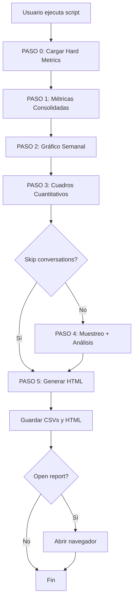

# 📊 Masterfile Universal v6.1 - Guía Completa

**Fecha:** 29 Enero 2026  
**Versión:** v6.1  
**Script:** `generar_reporte_cr_universal_v6.py`  
**Status:** ✅ PRODUCTION READY

---

## 🎯 **¿Qué es el Masterfile Universal v6.1?**

Es un generador **unificado** de reportes de Contact Rate que:

✅ Soporta **todos los Commerce Groups** (PDD, PNR, PCF, Shipping, Marketplace)  
✅ Genera **múltiples aperturas dinámicas** (Proceso, Tipificación, Environment, etc.)  
✅ Aplica **Regla 80%** automáticamente en todas las dimensiones  
✅ Produce **reportes HTML interactivos** con estructura v6.1  
✅ Integra **Hard Metrics** (con fallback si no existen)  
✅ Análisis de **conversaciones** (opcional)  
✅ **100% basado en datos reales** de BigQuery (no ficticios)

---

## 🚀 **Quick Start**

### **Ejecución básica (PDD MLA)**

```powershell
python generar_reporte_cr_universal_v6.py \
    --site MLA \
    --p1-start 2025-11-01 \
    --p1-end 2025-11-30 \
    --p2-start 2025-12-01 \
    --p2-end 2025-12-31 \
    --commerce-group PDD \
    --aperturas "PROCESO,TIPIFICACION,ENVIRONMENT,CLA_REASON_DETAIL" \
    --muestreo-dimension PROCESO \
    --open-report
```

**Resultado:** HTML con 4 cuadros cuantitativos (Proceso, Tipificación, Environment, CLA_REASON_DETAIL) + análisis de conversaciones por Proceso.

---

## 📋 **Parámetros del Script**

### **Obligatorios**

| Parámetro | Descripción | Ejemplo |
|-----------|-------------|---------|
| `--site` | Site a analizar | `MLA`, `MLB`, `MLC`, `MCO`, `MLM`, `MLU`, `MPE`, `MEC` |
| `--p1-start` | Fecha inicio período 1 | `2025-11-01` |
| `--p1-end` | Fecha fin período 1 | `2025-11-30` |
| `--p2-start` | Fecha inicio período 2 | `2025-12-01` |
| `--p2-end` | Fecha fin período 2 | `2025-12-31` |
| `--commerce-group` | Commerce Group | `PDD`, `PNR`, `PCF_COMPRADOR`, `PCF_VENDEDOR`, `ME_PREDESPACHO`, etc. |
| `--aperturas` | Dimensiones separadas por coma | `PROCESO,TIPIFICACION,ENVIRONMENT` |

### **Opcionales**

| Parámetro | Descripción | Default |
|-----------|-------------|---------|
| `--muestreo-dimension` | Dimensión para muestreo de conversaciones | `PROCESO` |
| `--output-dir` | Directorio de salida | `output` |
| `--open-report` | Abrir HTML al finalizar | `False` |
| `--skip-conversations` | Saltar análisis de conversaciones | `False` |

---

## 🔹 **Aperturas Disponibles**

| Apertura | Campo BigQuery | Uso recomendado |
|----------|----------------|------------------|
| `PROCESO` | `C.PROCESS_NAME` | Post-Compra, Shipping, Marketplace |
| `CDU` | `C.CDU` | Shipping, Marketplace (casos de uso) |
| `TIPIFICACION` | `C.REASON_DETAIL_GROUP_REPORTING` | Post-Compra (PDD/PNR/PCF) |
| `ENVIRONMENT` | `C.ENVIRONMENT` | Todos (FLEX, XD, DS, FBM) |
| `CLA_REASON_DETAIL` | `C.CLA_REASON_DETAIL` | Máximo nivel de detalle |
| `SOURCE_ID` | `C.CHANNEL_ID` | Análisis por canal |
| `SOLUTION_ID` | `C.SOLUTION_ID` | Análisis por solución |

### **📌 Combinaciones recomendadas por Commerce Group**

#### **PDD / PNR / PCF (Post-Compra)**
```powershell
--aperturas "PROCESO,TIPIFICACION,ENVIRONMENT,CLA_REASON_DETAIL"
--muestreo-dimension PROCESO
```

#### **Shipping (ME_PREDESPACHO, ME_DISTRIBUCION)**
```powershell
--aperturas "PROCESO,CDU,TIPIFICACION,ENVIRONMENT"
--muestreo-dimension CDU
```

#### **Marketplace (Ventas y Publicaciones, etc.)**
```powershell
--aperturas "PROCESO,CDU,SOURCE_ID"
--muestreo-dimension CDU
```

---

## 📊 **Estructura del Reporte v6.1**

El HTML generado tiene esta estructura:

```
1. HEADER
   - Título del reporte
   - Período, Site, Commerce Group
   - Badges de metodología

2. CARDS EJECUTIVAS (8 cards)
   Fila 1: CR P1 | CR P2 | Var CR | Var Incoming
   Fila 2: Inc P1 | Inc P2 | Driver P1 | Driver P2

3. GRÁFICO SEMANAL
   - Últimas 17 semanas
   - Chart.js interactivo

4. CUADROS CUANTITATIVOS
   Para cada apertura solicitada:
   - Tabla con 9 columnas
   - Regla 80% aplicada (filas priorizadas + "Otros" + "TOTAL")
   - Sin análisis cualitativo (solo números)

5. ANÁLISIS DE CONVERSACIONES (si no se salta)
   - Por proceso/CDU (según --muestreo-dimension)
   - 100 casos por elemento-período
   - CSVs exportados para análisis LLM posterior

6. FOOTER COLAPSABLE
   - Metadata técnica
   - Configuración del análisis
   - Fecha de generación
```

---

## 🔄 **Workflow Completo**



---

## 📂 **Archivos Generados**

Después de ejecutar el script, encontrarás en `output/`:

### **1. HTML Principal**
```
reporte_cr_pdd_mla_nov_dic_2025_v6.1.html
```
- Reporte interactivo completo
- Cuadros cuantitativos con datos reales
- Gráfico semanal
- Footer colapsable

### **2. CSVs de Cuadros Cuantitativos**
```
cuadro_proceso_mla_202511.csv
cuadro_tipificacion_mla_202511.csv
cuadro_environment_mla_202511.csv
cuadro_cla_reason_detail_mla_202511.csv
```
- 9 columnas por CSV
- Filas ordenadas por contribución
- "Otros" y "TOTAL" incluidos

### **3. CSVs de Conversaciones** (si no se salta)
```
conversaciones_Arrepentimiento_mla_202511.csv
conversaciones_Reclamo_por_Defecto_mla_202511.csv
```
- CASE_ID, PERIODO, CONVERSATION_SUMMARY, ORD_CLOSED_DATE
- 100 casos por proceso-período
- Para análisis LLM posterior

### **4. CSV Semanal**
```
weekly_mla_pdd_202511.csv
```
- Datos del gráfico semanal
- SEMANA, INCOMING, DRIVER, CR

---

## ⚡ **Ejemplos de Uso**

### **Ejemplo 1: PDD MLA con todas las aperturas**
```powershell
python generar_reporte_cr_universal_v6.py `
    --site MLA `
    --p1-start 2025-11-01 --p1-end 2025-11-30 `
    --p2-start 2025-12-01 --p2-end 2025-12-31 `
    --commerce-group PDD `
    --aperturas "PROCESO,TIPIFICACION,ENVIRONMENT,CLA_REASON_DETAIL" `
    --muestreo-dimension PROCESO `
    --open-report
```

**Tiempo estimado:** 3-5 minutos  
**Cuadros:** 4 (Proceso, Tipificación, Environment, CLA_REASON_DETAIL)  
**Conversaciones:** Sí (por Proceso)

---

### **Ejemplo 2: PNR MLB sin conversaciones (más rápido)**
```powershell
python generar_reporte_cr_universal_v6.py `
    --site MLB `
    --p1-start 2025-11-01 --p1-end 2025-11-30 `
    --p2-start 2025-12-01 --p2-end 2025-12-31 `
    --commerce-group PNR `
    --aperturas "PROCESO,TIPIFICACION,ENVIRONMENT" `
    --skip-conversations `
    --open-report
```

**Tiempo estimado:** 1-2 minutos  
**Cuadros:** 3 (Proceso, Tipificación, Environment)  
**Conversaciones:** No (saltado)

---

### **Ejemplo 3: Shipping ME_PREDESPACHO con CDU**
```powershell
python generar_reporte_cr_universal_v6.py `
    --site MLA `
    --p1-start 2025-11-01 --p1-end 2025-11-30 `
    --p2-start 2025-12-01 --p2-end 2025-12-31 `
    --commerce-group ME_PREDESPACHO `
    --aperturas "PROCESO,CDU,ENVIRONMENT" `
    --muestreo-dimension CDU `
    --open-report
```

**Tiempo estimado:** 3-4 minutos  
**Cuadros:** 3 (Proceso, CDU, Environment)  
**Conversaciones:** Sí (por CDU)

---

### **Ejemplo 4: Cross-Site (múltiples sites) - NO SOPORTADO v1.0**

⚠️ **Nota:** v6.1 inicial solo soporta **single-site**. Para análisis cross-site, ejecutar el script una vez por site y consolidar manualmente.

**Roadmap v6.2:** Soportar `--site MLA,MLB,MLC` para análisis cross-site automático.

---

## 🎛️ **Configuración Avanzada**

### **Commerce Groups Soportados**

El script tiene filtros pre-configurados para:

| Commerce Group | Filtro CASE |
|----------------|-------------|
| `PDD` | `PROCESS_PROBLEMATIC_REPORTING LIKE '%PDD%' OR = 'Conflict Others'` |
| `PNR` | `PROCESS_PROBLEMATIC_REPORTING LIKE '%PNR%' OR = 'Conflict Stale'` |
| `PCF_COMPRADOR` | `PROCESS_PROBLEMATIC_REPORTING LIKE '%Post Compra%' AND PROCESS_GROUP_ECOMMERCE = 'Comprador'` |
| `PCF_VENDEDOR` | `PROCESS_PROBLEMATIC_REPORTING LIKE '%Post Compra%' AND PROCESS_GROUP_ECOMMERCE = 'Vendedor'` |

**Para agregar nuevos commerce groups:** Editar `COMMERCE_GROUP_FILTERS` en el script.

---

### **Colores por Commerce Group**

El script usa colores distintos según el commerce group:

| Grupo | Color | Hex Code |
|-------|-------|----------|
| Post-Compra (PDD/PNR/PCF) | Verde | `#00a650` |
| Shipping | Azul | `#3483fa` |
| Marketplace | Amarillo | `#ffe600` |

**Para cambiar colores:** Editar `COLORS` en el script.

---

## 🔧 **Troubleshooting**

### **Error: "Commerce group 'XXX' no tiene filtro definido"**

**Causa:** El commerce group no está en `COMMERCE_GROUP_FILTERS`.  
**Solución:** Agregar el filtro CASE en el script o usar un commerce group existente.

---

### **Error: "Dimensión 'XXX' no tiene campo mapeado"**

**Causa:** La apertura no está en `FIELD_MAPPING`.  
**Solución:** Verificar que la apertura esté bien escrita (mayúsculas) o agregar el mapeo en el script.

---

### **Warning: "No hay conversaciones para 'XXX'"**

**Causa:** No existen conversaciones en `BT_CX_STUDIO_SAMPLE` para ese elemento.  
**Efecto:** El proceso se marca como "sin_data" y continúa el reporte.  
**Acción:** Normal, no requiere intervención. Verificar si el período es muy antiguo (>6 meses).

---

### **Query tarda mucho (>10 minutos)**

**Causa posible:**
1. Site MLB sin sampling (Brasil tiene mucho volumen)
2. Múltiples aperturas con CLA_REASON_DETAIL (muy granular)
3. Período muy amplio (>6 meses)

**Solución:**
- Para MLB: Implementar sampling (ver `sql/sampling-strategy.sql`)
- Reducir número de aperturas en la primera ejecución
- Usar `--skip-conversations` para pruebas rápidas

---

## 📊 **Regla 80% - Cómo Funciona**

Para cada dimensión:

1. Se ordena por **variación absoluta** (|INC_P2 - INC_P1|)
2. Se calcula **contribución %** = VAR_ABS / TOTAL_VAR * 100
3. Se toman elementos hasta acumular **80%**
4. Los elementos restantes se agrupan en **"Otros"**
5. Se agrega fila **"TOTAL"** con 100%

**Ejemplo visual:**

```
Elemento A: 52.3% → Incluido
Elemento B: 31.7% → Incluido (acum 84%)
Elemento C: 8.0%  → "Otros"
Elemento D: 5.0%  → "Otros"
Elemento E: 3.0%  → "Otros"
──────────────────────────────
TOTAL: 100.0%
```

**Beneficio:** Enfoca el análisis en lo que realmente importa, sin perder visibilidad del total.

---

## 🚀 **Roadmap**

### **v6.2 (Próxima versión)**
- [ ] Análisis LLM automático de conversaciones (integrado en el script)
- [ ] Soportar múltiples sites (cross-site)
- [ ] Peak detection automático por elemento
- [ ] Evolución de patrones (tabla Nov vs Dic)
- [ ] Template Jinja2 (en lugar de HTML inline)

### **v6.3 (Futuro)**
- [ ] Deep dive ad-hoc desde el HTML (botones interactivos)
- [ ] Exportar a PowerPoint (slides automáticos)
- [ ] Integración con Slack/Email (envío automático)
- [ ] Dashboard interactivo (filtros dinámicos)

---

## 📚 **Referencias**

- **Prototipo v6.1:** `output/prototipo_v6.1_pdd_mla_nov_dic_2025.html`
- **Comparativa v6.0 vs v6.1:** `output/COMPARATIVA_v6.0_v6.1.md`
- **Golden Templates:** `docs/GOLDEN_TEMPLATES.md`
- **Reglas críticas:** `.cursorrules` (Reglas 1-6, Regla 80%)
- **Metodología v5.0:** `docs/GUIDELINES.md`

---

## ✅ **Checklist de Validación**

Antes de usar el reporte, verificar:

### **Datos**
- [ ] Los nombres de procesos/tipificaciones son reales (no ficticios)
- [ ] Los totales coinciden en todas las tablas
- [ ] La contribución suma 100% en cada dimensión
- [ ] El gráfico semanal muestra tendencia coherente

### **Cálculos**
- [ ] CR = (Incoming / Driver) × 100
- [ ] Drivers son globales (no filtrados por site)
- [ ] Variación CR en pp (no solo %)
- [ ] Regla 80% aplicada correctamente

### **Estructura**
- [ ] 8 cards en orden correcto
- [ ] Gráfico después de cards
- [ ] Cuadros cuantitativos sin análisis cualitativo
- [ ] Footer colapsable

---

**¿Dudas o problemas?** Revisar:
1. Esta guía (MASTERFILE_v6.1_GUIA.md)
2. `.cursorrules` (reglas críticas)
3. `docs/GUIDELINES.md` (buenas prácticas)
4. Ejemplos en `ejemplos/`

**¡Listo para generar reportes! 🚀**
